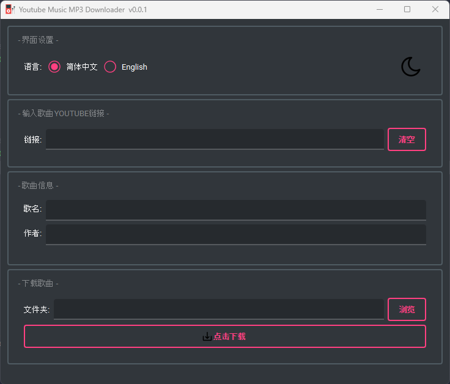

# Music_Downloader_Lite

## Showcase

## Description

A minimal application to download music as .mp3 files from YouTube. It
automatically downloads the best quality audio with the highest bit rates.

The application uses [PyTube](https://github.com/pytube/pytube) to download
the audio files and uses [PySide6](https://pypi.org/project/PySide6/) to
create the simple GUI.

## How to use

Either download the .exe file from the release or `python main.py` to run
from the source.

## Features

1. Simple to use.
2. Edit the song title and author name within the application, so the
   downloaded files will have a uniform name.
3. Language support 简体中文 and English.
4. Light/Dark modes.

## Not Support

Currently I just want to use this application download a single track only, the
application **DOES
NOT** support:

1. Download video files.
2. Download playlists.

----

## 介绍

将YouTube上的音乐以MP3格式下载到本地。默认下载最高品质音乐。

通过[PyTube](https://github.com/pytube/pytube)后台处理文件下载，前端的图形界面通过
[PySide6](https://pypi.org/project/PySide6/)实现.

## 如何使用

从Release中下载exe文件开箱即用， 或者将仓库代码下载到本地后运行`python main.py`。

## 特性和功能

1. 界面简单易操作。
2. 通过编辑歌名和作者名，保证文件下载到本地后格式统一。
3. 支持 简体中文 和 English。
4. 浅色和深色主题切换。

## 暂不支持

1. 下载视频文件。
2. 下载播放列表。

